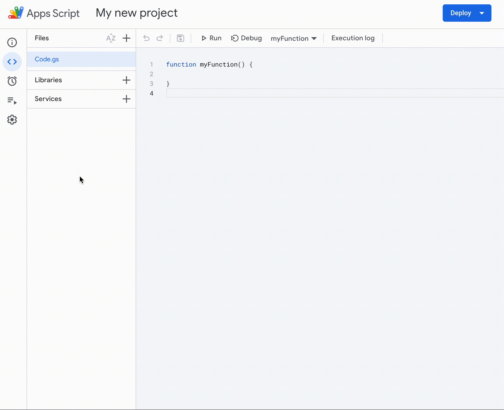
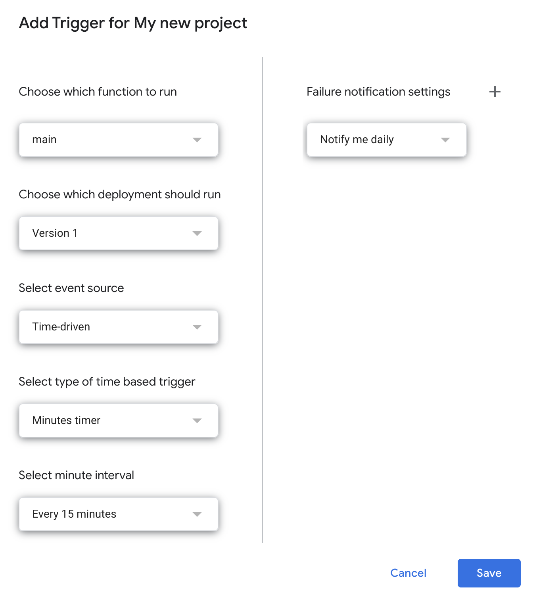

# 📧 Gmail Apps Script

Enhanced Gmail 📥 management using
[Google Apps Script](https://script.google.com).

## Motivation

I get a lot of email notifications from services like GitHub and Asana. I want
to filter and label emails based on a certain set of criteria. For example:

- All pull requests (PRs) should be labeled "PR".
  - I want PRs from my teammates to stay in my inbox; otherwise, they should be
    archived for future reference.
- Emails from my manager or leadership team should be labeled "Leadership".
  - But I get a lot of automated emails from Asana under my manager's name, so
    those should not be labeled.
- Asana generates a lot of emails. Only keep the ones that explicitly mention me
  in the inbox; otherwise, archive them.
  - I could turn off email notifications in Asana, but I generally like getting
    them for future searches in Gmail.

Gmail's filters don't offer this granular control. Enter Google Apps Script.

## Setup

1. Copy and adjust the code in `code.js`
   - Replace rules and names to suit your needs
2. Create a new project at https://script.google.com
3. Add the Gmail service to your project
   
4. Paste your modified `code.js` into the editor
5. Save and run to test your code
   - You may need to grant the script access to your inbox on the first run
   - Use `Logger.log()` to debug
   - Also see the
     [Gmail API documentation](https://developers.google.com/gmail/api/reference/rest)
     for additional resources

## Deploy

When ready to deploy into production:

1. Click _Deploy_ > _New deployment_
2. Click the gear icon and select the _Web app_ type
3. Enter a description and click _Deploy_
4. On the left navbar, click _Triggers_
5. In the bottom right, click _Add Trigger_
6. Choose the `main` function to run, and choose the deployment version you just
   created
   - Use a time-based trigger, and run as often as you like
     
7. Click _Save_

_Voila!_ Your Gmail inbox will now be automatically managed by your App Script.
Now about that PR that needs writing...
